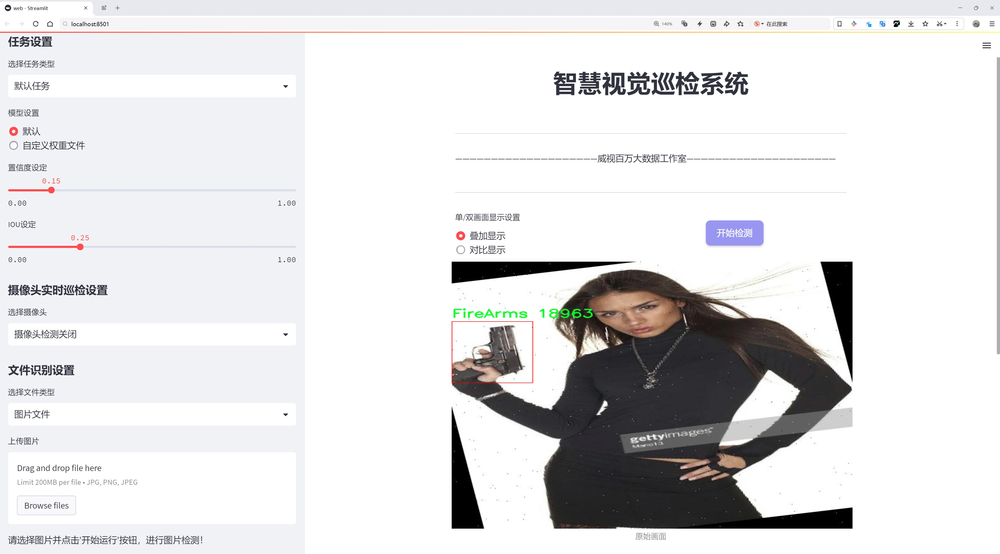
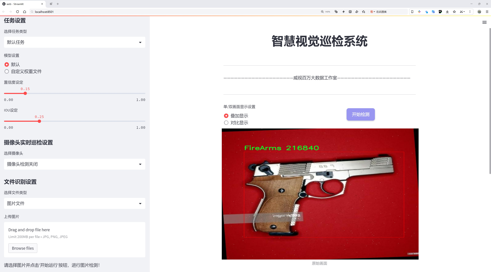
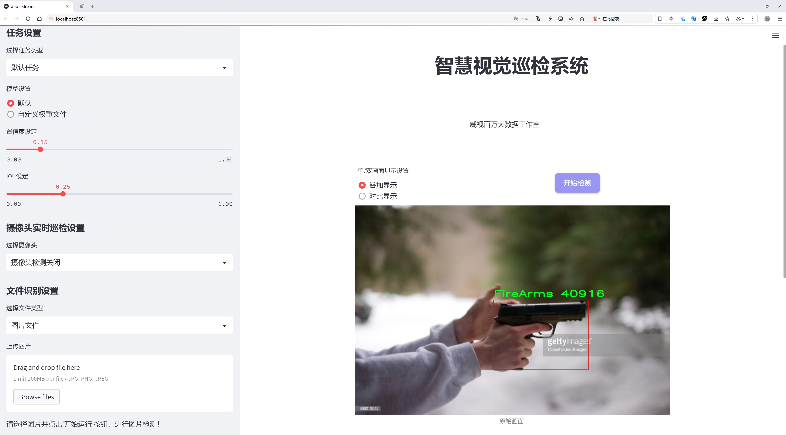
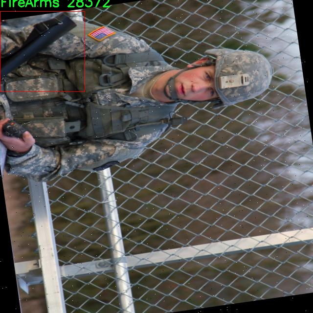
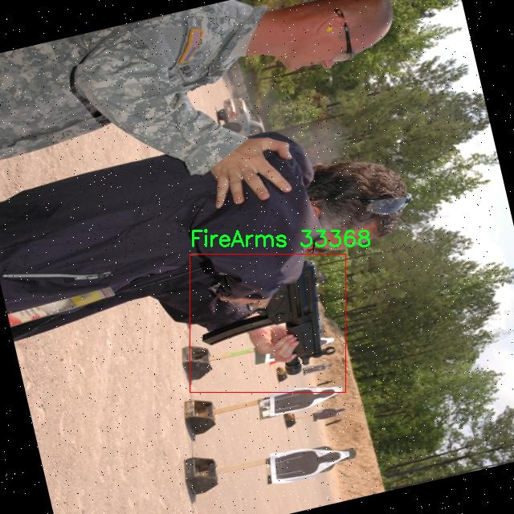
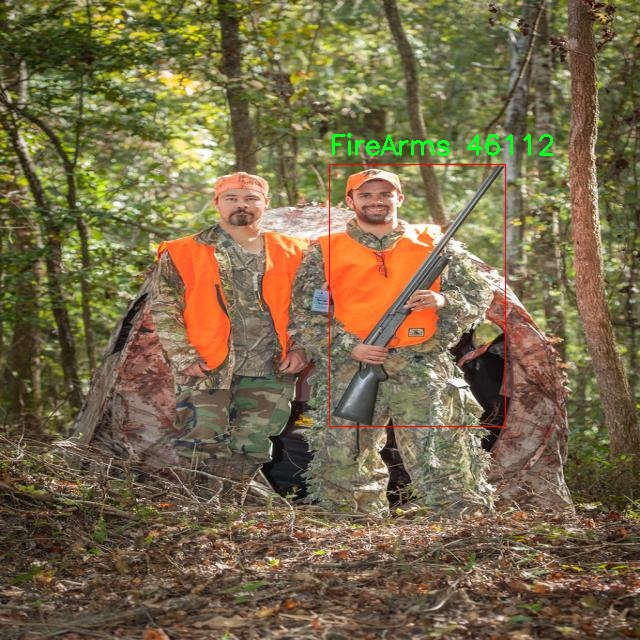
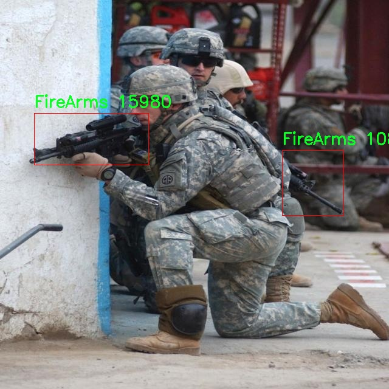
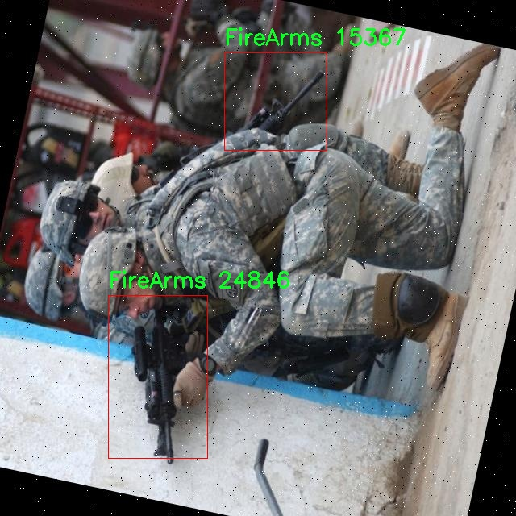

# 有威胁的武器武装检测检测系统源码分享
 # [一条龙教学YOLOV8标注好的数据集一键训练_70+全套改进创新点发刊_Web前端展示]

### 1.研究背景与意义

项目参考[AAAI Association for the Advancement of Artificial Intelligence](https://gitee.com/qunmasj/projects)

项目来源[AACV Association for the Advancement of Computer Vision](https://kdocs.cn/l/cszuIiCKVNis)

研究背景与意义

随着全球安全形势的日益复杂，武器及其相关威胁的检测与识别已成为社会安全领域的重要研究课题。尤其是在公共场所、交通枢纽及大型活动中，及时有效地识别潜在的武器威胁，对于预防暴力事件、保护公众安全具有重要意义。近年来，计算机视觉技术的快速发展，尤其是深度学习算法的广泛应用，为武器检测提供了新的思路和方法。其中，YOLO（You Only Look Once）系列模型因其高效的实时检测能力，成为物体检测领域的热门选择。YOLOv8作为该系列的最新版本，具备更高的准确性和更快的处理速度，适合于复杂环境下的威胁检测任务。

本研究旨在基于改进的YOLOv8模型，构建一个针对有威胁武器的检测系统。数据集包含2825张图像，涵盖两类武器：火器（FireArms）和锐器（Sharp_object）。这些类别的选择不仅反映了当前社会中常见的武器类型，也为模型的训练提供了明确的目标。通过对这些数据的深入分析与处理，能够有效提升模型的识别精度，进而增强系统的实用性。

在当前的研究背景下，许多传统的武器检测方法依赖于人工监控或简单的图像处理技术，效率低下且容易受到环境因素的影响。而基于深度学习的自动化检测系统，能够在多种复杂场景中保持较高的识别率和鲁棒性。因此，改进YOLOv8模型的研究，不仅具有重要的理论价值，也具备显著的实际应用前景。

此外，随着社会对安全问题的关注加剧，相关技术的研究和应用逐渐成为政府、企业及研究机构的重点。通过构建一个高效的武器检测系统，可以为公共安全管理提供技术支持，降低潜在的安全风险。同时，该系统的成功应用，能够为其他领域的物体检测任务提供借鉴，推动计算机视觉技术的进一步发展。

本研究的意义还在于，通过对YOLOv8模型的改进，探索其在特定应用场景下的适应性与性能优化。这不仅有助于提升武器检测的准确性和实时性，还能为后续的研究提供基础数据和经验支持。通过对数据集的充分利用，结合最新的深度学习技术，力求在武器检测领域取得突破性进展。

综上所述，基于改进YOLOv8的有威胁武器检测系统的研究，不仅响应了社会对安全技术的迫切需求，也为计算机视觉领域的相关研究提供了新的思路和方法。随着技术的不断进步，期待该系统能够在实际应用中发挥重要作用，为维护社会安全贡献力量。

### 2.图片演示







##### 注意：由于此博客编辑较早，上面“2.图片演示”和“3.视频演示”展示的系统图片或者视频可能为老版本，新版本在老版本的基础上升级如下：（实际效果以升级的新版本为准）

  （1）适配了YOLOV8的“目标检测”模型和“实例分割”模型，通过加载相应的权重（.pt）文件即可自适应加载模型。

  （2）支持“图片识别”、“视频识别”、“摄像头实时识别”三种识别模式。

  （3）支持“图片识别”、“视频识别”、“摄像头实时识别”三种识别结果保存导出，解决手动导出（容易卡顿出现爆内存）存在的问题，识别完自动保存结果并导出到tempDir中。

  （4）支持Web前端系统中的标题、背景图等自定义修改，后面提供修改教程。

  另外本项目提供训练的数据集和训练教程,暂不提供权重文件（best.pt）,需要您按照教程进行训练后实现图片演示和Web前端界面演示的效果。

### 3.视频演示

[3.1 视频演示](https://www.bilibili.com/video/BV1mvxuecESE/)

### 4.数据集信息展示

##### 4.1 本项目数据集详细数据（类别数＆类别名）

nc: 2
names: ['FireArms', 'Sharp_object']


##### 4.2 本项目数据集信息介绍

数据集信息展示

在现代安全防护领域，威胁检测系统的研发至关重要，尤其是在公共场所和重要设施的安全保障中。为此，我们构建了一个名为“threat detection”的数据集，旨在为改进YOLOv8模型在有威胁的武器武装检测方面提供强有力的支持。该数据集专注于两类主要的威胁物品，分别是“FireArms”（火器）和“Sharp_object”（锐器），通过对这两类物品的精确识别与分类，提升模型在实际应用中的有效性和可靠性。

“threat detection”数据集的设计充分考虑了多样性和代表性，涵盖了多种类型的火器和锐器。火器类别包括手枪、步枪、霰弹枪等，锐器则包括刀具、尖锐工具等。这种多样性不仅有助于模型学习到不同物品的特征，还能增强其在复杂环境下的适应能力。数据集中的每一张图像都经过精心标注，确保每个物品的边界框和类别标签的准确性，为模型的训练提供了坚实的基础。

为了确保数据集的质量，我们采用了多种数据采集方法，包括实地拍摄、合成图像生成等。实地拍摄的图像来自于不同的场景和角度，确保了数据集的丰富性和多样性。而合成图像则通过计算机视觉技术生成，能够模拟各种光照、背景和遮挡条件，进一步增强了数据集的鲁棒性。这种多元化的数据来源，使得“threat detection”数据集能够有效应对现实世界中可能遇到的各种复杂情况。

在数据集的构建过程中，我们还特别注重数据的平衡性，确保每个类别的样本数量相对均衡。这一策略不仅能够避免模型在训练过程中对某一类别的偏倚，还能提高模型的整体性能。通过对数据集的精细化管理，我们希望能够实现更高的检测精度和更低的误报率，从而为实际应用提供更为可靠的技术支持。

此外，为了方便研究人员和开发者使用，我们为“threat detection”数据集提供了详细的文档和使用指南，涵盖数据集的结构、标注格式、数据预处理方法等信息。这些文档旨在帮助用户快速上手，减少在数据处理和模型训练过程中的时间成本。

总之，“threat detection”数据集不仅是一个用于训练YOLOv8模型的工具，更是推动有威胁的武器武装检测技术发展的重要资源。通过对火器和锐器的精准识别与分类，我们期望能够为公共安全领域的技术进步贡献一份力量，为社会的安全稳定提供更为坚实的保障。随着技术的不断进步和数据集的持续更新，我们相信“threat detection”将为未来的威胁检测系统奠定更加坚实的基础。











### 5.全套项目环境部署视频教程（零基础手把手教学）

[5.1 环境部署教程链接（零基础手把手教学）](https://www.ixigua.com/7404473917358506534?logTag=c807d0cbc21c0ef59de5)


[5.2 安装Python虚拟环境创建和依赖库安装视频教程链接（零基础手把手教学）](https://www.ixigua.com/7404474678003106304?logTag=1f1041108cd1f708b01a)

### 6.手把手YOLOV8训练视频教程（零基础小白有手就能学会）

[6.1 手把手YOLOV8训练视频教程（零基础小白有手就能学会）](https://www.ixigua.com/7404477157818401292?logTag=d31a2dfd1983c9668658)

### 7.70+种全套YOLOV8创新点代码加载调参视频教程（一键加载写好的改进模型的配置文件）

[7.1 70+种全套YOLOV8创新点代码加载调参视频教程（一键加载写好的改进模型的配置文件）](https://www.ixigua.com/7404478314661806627?logTag=29066f8288e3f4eea3a4)

### 8.70+种全套YOLOV8创新点原理讲解（非科班也可以轻松写刊发刊，V10版本正在科研待更新）

由于篇幅限制，每个创新点的具体原理讲解就不一一展开，具体见下列网址中的创新点对应子项目的技术原理博客网址【Blog】：


[8.1 70+种全套YOLOV8创新点原理讲解链接](https://gitee.com/qunmasj/good)

### 9.系统功能展示（检测对象为举例，实际内容以本项目数据集为准）

图9.1.系统支持检测结果表格显示

  图9.2.系统支持置信度和IOU阈值手动调节

  图9.3.系统支持自定义加载权重文件best.pt(需要你通过步骤5中训练获得)

  图9.4.系统支持摄像头实时识别

  图9.5.系统支持图片识别

  图9.6.系统支持视频识别

  图9.7.系统支持识别结果文件自动保存

  图9.8.系统支持Excel导出检测结果数据


### 10.原始YOLOV8算法原理

原始YOLOv8算法原理

YOLOv8作为YOLO系列的最新版本，继续秉承了一阶段目标检测的核心理念，通过将目标检测任务转化为回归问题，利用单一神经网络同时预测目标的位置和类别。该算法在YOLOv5和YOLOv7的基础上进行了多项创新和改进，形成了一个更加高效和精确的目标检测框架。YOLOv8的网络结构主要由输入层、主干网络、特征融合层和解耦头组成，这一设计不仅延续了YOLO系列的优良传统，还引入了多种新技术，进一步提升了检测性能。

在主干网络方面，YOLOv8依然采用了CSPDarknet的设计理念，但对其进行了优化。具体而言，YOLOv8将YOLOv5中的C3模块替换为C2f模块，这一变化使得网络在保持轻量化的同时，检测精度得以维持甚至提升。C2f模块的设计灵感来源于YOLOv7的ELAN思想，具有更丰富的残差连接，能够有效缓解深层网络中的梯度消失问题。C2f模块由多个CBS（卷积+归一化+SiLU激活）构成，结合了Bottleneck结构，使得特征图的提取更加高效。在此基础上，YOLOv8还采用了SPPF模块，以增强特征提取的能力，确保网络能够捕捉到更多的细节信息。

特征融合层的设计同样至关重要，YOLOv8使用了PAN-FPN结构，这一结构能够实现多尺度特征的深度融合。与YOLOv5不同的是，YOLOv8在上采样阶段删除了1x1卷积，这一改动使得特征融合过程更加简洁高效。通过将高层特征与中层特征和浅层特征进行充分融合，YOLOv8能够更好地捕捉到目标的语义信息和细节信息，从而提升检测的准确性。

在检测头的设计上，YOLOv8采用了解耦头结构，将分类和回归任务分开处理。这一创新使得每个任务能够更加专注于自身的目标，从而有效解决了复杂场景下的定位不准和分类错误的问题。YOLOv8的解耦头部分借鉴了YOLOX和YOLOv6的设计，取消了objectness分支，通过边框回归和目标分类的独立处理，进一步提升了检测的精度和效率。此外，YOLOv8还引入了Anchor-Free的思想，摒弃了传统的Anchor-Based方法，直接通过回归方式预测目标的位置和大小，使得网络在处理不同尺度和形状的目标时更加灵活。

损失函数的设计也是YOLOv8的一大亮点。YOLOv8使用了VFLLoss作为分类损失，DFLLoss和CIoULoss作为回归损失，这一组合能够有效提升模型的学习能力，特别是在面对样本不平衡和困难样本时。通过合理的损失函数设计，YOLOv8能够更好地优化网络参数，提高检测精度。

在样本匹配策略方面，YOLOv8将静态匹配改为Task-Aligned的Assigner匹配方式，这一改动使得样本分配更加灵活和高效，能够更好地适应不同的训练需求。数据预处理方面，YOLOv8延续了YOLOv5的策略，采用了多种数据增强手段，如马赛克增强、混合增强、空间扰动和颜色扰动等，进一步提升了模型的鲁棒性。

综上所述，YOLOv8通过对主干网络、特征融合层、检测头和损失函数等多个方面的优化和创新，形成了一个高效、精确的目标检测算法。其在训练时间和检测精度上的提升，使得YOLOv8能够在实时检测任务中表现出色，适应多种应用场景的需求。随着YOLOv8的推出，目标检测领域的研究和应用将迎来新的发展机遇，推动智能视觉技术的进一步进步。


### 11.项目核心源码讲解（再也不用担心看不懂代码逻辑）

#### 11.1 70+种YOLOv8算法改进源码大全和调试加载训练教程（非必要）\ultralytics\utils\callbacks\raytune.py

以下是代码的核心部分，并附上详细的中文注释：

```python
# 导入必要的库和模块
from ultralytics.utils import SETTINGS

# 尝试导入Ray和相关模块
try:
    # 确保Ray Tune集成已启用
    assert SETTINGS['raytune'] is True  
    import ray
    from ray import tune
    from ray.air import session

# 如果导入失败或集成未启用，则将tune设置为None
except (ImportError, AssertionError):
    tune = None

# 定义在每个训练周期结束时调用的函数
def on_fit_epoch_end(trainer):
    """在每个训练周期结束时，将训练指标发送到Ray Tune。"""
    # 检查Ray Tune会话是否启用
    if ray.tune.is_session_enabled():
        # 获取当前训练指标
        metrics = trainer.metrics
        # 添加当前周期信息
        metrics['epoch'] = trainer.epoch
        # 向Ray Tune报告当前指标
        session.report(metrics)

# 根据是否启用tune，定义回调函数
callbacks = {
    'on_fit_epoch_end': on_fit_epoch_end,  # 训练周期结束时的回调
} if tune else {}
```

### 代码核心部分分析：
1. **导入模块**：代码首先导入了`SETTINGS`，这是用于检查Ray Tune集成是否启用的配置。
2. **异常处理**：通过`try-except`结构，确保在Ray Tune未启用或导入失败时不会导致程序崩溃。
3. **定义回调函数**：`on_fit_epoch_end`函数用于在每个训练周期结束时，将训练的指标发送到Ray Tune，以便进行监控和调优。
4. **回调字典**：根据Ray Tune的启用状态，决定是否将回调函数添加到`callbacks`字典中。

### 重要性：
这段代码的核心在于实现了与Ray Tune的集成，允许在训练过程中实时监控和记录训练指标，这对于模型的调优和性能分析至关重要。

这个文件是Ultralytics YOLO项目中的一个回调模块，主要用于与Ray Tune集成，以便在训练过程中监控和记录训练指标。文件的开头部分包含了版权声明和许可证信息，表明该代码遵循AGPL-3.0许可证。

在代码中，首先从`ultralytics.utils`模块导入了`SETTINGS`，这是一个配置字典，用于存储各种设置。接着，代码尝试检查`SETTINGS`中是否启用了Ray Tune集成。具体来说，它通过断言`SETTINGS['raytune']`为真来验证这一点。如果Ray Tune未启用，或者导入Ray库时发生错误，`tune`将被设置为`None`，这意味着后续的回调功能将不会被激活。

接下来定义了一个名为`on_fit_epoch_end`的函数，这个函数会在每个训练周期结束时被调用。它的作用是将训练过程中收集到的指标发送到Ray Tune。函数内部首先检查Ray Tune的会话是否已启用，如果启用，则从训练器（trainer）中获取当前的训练指标，并将当前的周期数（epoch）添加到这些指标中。最后，使用`session.report(metrics)`将这些指标报告给Ray Tune，以便进行监控和分析。

最后，代码构建了一个名为`callbacks`的字典，其中包含了`on_fit_epoch_end`回调函数，前提是Ray Tune已被成功导入并启用。如果Ray Tune未启用，则`callbacks`字典将为空。这种设计使得代码在使用Ray Tune时能够灵活地添加回调功能，而在不使用时则不会引入额外的复杂性。

#### 11.2 code\ultralytics\utils\instance.py

以下是经过简化和注释的核心代码部分，主要包括 `Bboxes` 和 `Instances` 类的实现。注释详细解释了每个方法和属性的功能。

```python
import numpy as np

class Bboxes:
    """
    处理边界框的类，支持多种格式（'xyxy', 'xywh', 'ltwh'）。
    属性:
        bboxes (numpy.ndarray): 存储边界框的二维数组。
        format (str): 边界框的格式（'xyxy', 'xywh', 'ltwh'）。
    """

    def __init__(self, bboxes, format="xyxy") -> None:
        """初始化 Bboxes 类，接受边界框数据和格式。"""
        assert format in ["xyxy", "xywh", "ltwh"], f"无效的边界框格式: {format}"
        bboxes = bboxes[None, :] if bboxes.ndim == 1 else bboxes  # 确保是二维数组
        assert bboxes.ndim == 2 and bboxes.shape[1] == 4, "边界框应为二维数组，且每个框有4个坐标"
        self.bboxes = bboxes
        self.format = format

    def convert(self, format):
        """将边界框格式转换为指定格式。"""
        assert format in ["xyxy", "xywh", "ltwh"], f"无效的边界框格式: {format}"
        if self.format == format:
            return  # 如果格式相同，则不需要转换
        # 根据当前格式和目标格式选择转换函数
        func = self._get_conversion_function(format)
        self.bboxes = func(self.bboxes)  # 执行转换
        self.format = format  # 更新格式

    def _get_conversion_function(self, format):
        """根据当前格式和目标格式返回相应的转换函数。"""
        if self.format == "xyxy":
            return xyxy2xywh if format == "xywh" else xyxy2ltwh
        elif self.format == "xywh":
            return xywh2xyxy if format == "xyxy" else xywh2ltwh
        else:
            return ltwh2xyxy if format == "xyxy" else ltwh2xywh

    def areas(self):
        """计算并返回每个边界框的面积。"""
        self.convert("xyxy")  # 确保格式为 xyxy
        return (self.bboxes[:, 2] - self.bboxes[:, 0]) * (self.bboxes[:, 3] - self.bboxes[:, 1])  # 宽 * 高

    def __len__(self):
        """返回边界框的数量。"""
        return len(self.bboxes)

class Instances:
    """
    存储图像中检测到的对象的边界框、分段和关键点的容器。
    属性:
        _bboxes (Bboxes): 内部对象，用于处理边界框操作。
        keypoints (ndarray): 关键点数组，形状为 [N, 17, 3]。
        segments (ndarray): 分段数组，形状为 [N, 1000, 2]。
    """

    def __init__(self, bboxes, segments=None, keypoints=None, bbox_format="xywh", normalized=True) -> None:
        """初始化 Instances 类，接受边界框、分段和关键点数据。"""
        self._bboxes = Bboxes(bboxes=bboxes, format=bbox_format)  # 创建 Bboxes 对象
        self.keypoints = keypoints
        self.normalized = normalized
        self.segments = segments

    def convert_bbox(self, format):
        """转换边界框格式。"""
        self._bboxes.convert(format=format)

    @property
    def bbox_areas(self):
        """计算边界框的面积。"""
        return self._bboxes.areas()

    def scale(self, scale_w, scale_h, bbox_only=False):
        """按比例缩放边界框、分段和关键点。"""
        self._bboxes.mul(scale=(scale_w, scale_h, scale_w, scale_h))  # 缩放边界框
        if not bbox_only:
            self.segments[..., 0] *= scale_w  # 缩放分段
            self.segments[..., 1] *= scale_h
            if self.keypoints is not None:
                self.keypoints[..., 0] *= scale_w  # 缩放关键点
                self.keypoints[..., 1] *= scale_h

    def __getitem__(self, index) -> "Instances":
        """通过索引获取特定实例或实例集合。"""
        segments = self.segments[index] if len(self.segments) else self.segments
        keypoints = self.keypoints[index] if self.keypoints is not None else None
        bboxes = self._bboxes[index]
        bbox_format = self._bboxes.format
        return Instances(bboxes=bboxes, segments=segments, keypoints=keypoints, bbox_format=bbox_format, normalized=self.normalized)

    def __len__(self):
        """返回实例的数量。"""
        return len(self._bboxes)
```

### 代码说明：
1. **Bboxes 类**：
   - 负责处理边界框的初始化、格式转换和面积计算。
   - 提供了 `convert` 方法用于转换边界框格式，以及 `areas` 方法计算每个边界框的面积。

2. **Instances 类**：
   - 用于存储图像中检测到的对象的边界框、分段和关键点。
   - 提供了 `scale` 方法用于缩放边界框和其他相关数据，以及 `convert_bbox` 方法用于转换边界框格式。

这些类为处理计算机视觉中的边界框提供了基础功能，支持多种格式和操作。

这个程序文件是一个用于处理目标检测中边界框（bounding boxes）的工具类，主要包括两个类：`Bboxes`和`Instances`。这些类支持多种边界框格式的转换和操作，适用于计算机视觉任务中的目标检测。

首先，`Bboxes`类用于管理边界框，支持三种格式：`xyxy`（左上角和右下角坐标）、`xywh`（中心坐标和宽高）以及`ltwh`（左上角坐标和宽高）。在初始化时，`Bboxes`类会检查输入的格式是否有效，并确保输入的边界框数据是一个二维的NumPy数组，且每个边界框包含四个值。该类提供了多种方法，包括格式转换、计算面积、缩放、添加偏移量等。通过`convert`方法，可以在不同格式之间进行转换，而`areas`方法则计算所有边界框的面积。

`Instances`类是一个更高级的容器，除了包含边界框外，还可以存储分割（segments）和关键点（keypoints）信息。它在初始化时会创建一个`Bboxes`对象来处理边界框，并允许用户传入分割和关键点数据。`Instances`类提供了多种方法来处理和转换这些数据，包括归一化、去归一化、添加填充、翻转、裁剪等操作。此外，它还支持通过索引获取特定的实例或实例集合。

这两个类的设计使得用户可以方便地处理目标检测中的边界框及其相关信息，支持多种常见的操作和格式转换，适用于各种计算机视觉应用。整体上，这个文件提供了一个灵活且功能强大的工具集，帮助开发者在处理目标检测任务时更加高效。

#### 11.3 ui.py

以下是代码中最核心的部分，并附上详细的中文注释：

```python
import sys
import subprocess

def run_script(script_path):
    """
    使用当前 Python 环境运行指定的脚本。

    Args:
        script_path (str): 要运行的脚本路径

    Returns:
        None
    """
    # 获取当前 Python 解释器的路径
    python_path = sys.executable

    # 构建运行命令，使用 streamlit 运行指定的脚本
    command = f'"{python_path}" -m streamlit run "{script_path}"'

    # 执行命令，并等待其完成
    result = subprocess.run(command, shell=True)
    
    # 检查命令执行的返回码，如果不为0，表示执行出错
    if result.returncode != 0:
        print("脚本运行出错。")

# 实例化并运行应用
if __name__ == "__main__":
    # 指定要运行的脚本路径
    script_path = "web.py"  # 这里可以直接指定脚本路径

    # 调用函数运行脚本
    run_script(script_path)
```

### 代码注释说明：
1. **导入模块**：
   - `sys`：用于访问与 Python 解释器紧密相关的变量和函数。
   - `subprocess`：用于创建新进程、连接到它们的输入/输出/错误管道，并获得返回码。

2. **`run_script` 函数**：
   - 该函数接受一个脚本路径作为参数，并使用当前 Python 环境运行该脚本。
   - 使用 `sys.executable` 获取当前 Python 解释器的路径，以确保使用正确的 Python 版本来运行脚本。
   - 构建一个命令字符串，使用 `streamlit` 模块运行指定的脚本。
   - 使用 `subprocess.run` 执行构建的命令，并等待其完成。
   - 检查返回码，如果返回码不为0，表示脚本运行过程中出现了错误。

3. **主程序部分**：
   - 使用 `if __name__ == "__main__":` 确保只有在直接运行该脚本时才会执行以下代码。
   - 指定要运行的脚本路径（这里是 `web.py`）。
   - 调用 `run_script` 函数来运行指定的脚本。

这个程序文件名为 `ui.py`，其主要功能是通过当前的 Python 环境来运行一个指定的脚本。程序首先导入了必要的模块，包括 `sys`、`os` 和 `subprocess`，以及一个自定义的路径处理模块 `abs_path`。

在 `run_script` 函数中，程序接受一个参数 `script_path`，这个参数是要运行的脚本的路径。函数首先获取当前 Python 解释器的路径，这样可以确保使用正确的 Python 环境来执行脚本。接着，程序构建了一个命令字符串，该命令使用 `streamlit` 模块来运行指定的脚本。这里使用了 `subprocess.run` 方法来执行这个命令，并通过 `shell=True` 参数允许在 shell 中执行。

如果脚本运行过程中出现错误，程序会检查返回码 `result.returncode`，如果不为零，则打印出“脚本运行出错”的信息。

在文件的最后部分，程序通过 `if __name__ == "__main__":` 语句来确保只有在直接运行该文件时才会执行以下代码。它指定了要运行的脚本路径，这里使用了 `abs_path` 函数来获取 `web.py` 的绝对路径。最后，调用 `run_script` 函数来执行这个脚本。

总体来说，这个程序的作用是方便地运行一个名为 `web.py` 的脚本，确保使用当前的 Python 环境，并处理可能出现的错误。

#### 11.4 70+种YOLOv8算法改进源码大全和调试加载训练教程（非必要）\ultralytics\nn\modules\head.py

以下是代码中最核心的部分，并附上详细的中文注释：

```python
import torch
import torch.nn as nn

class Detect(nn.Module):
    """YOLOv8 检测头，用于目标检测模型。"""
    
    def __init__(self, nc=80, ch=()):
        """初始化 YOLOv8 检测层，指定类别数和通道数。
        
        参数:
            nc (int): 类别数，默认为 80。
            ch (tuple): 输入通道数的元组。
        """
        super().__init__()
        self.nc = nc  # 类别数
        self.nl = len(ch)  # 检测层的数量
        self.reg_max = 16  # DFL 通道数
        self.no = nc + self.reg_max * 4  # 每个锚点的输出数量
        self.stride = torch.zeros(self.nl)  # 在构建时计算的步幅
        
        # 定义卷积层
        c2, c3 = max((16, ch[0] // 4, self.reg_max * 4)), max(ch[0], min(self.nc, 100))  # 通道数
        self.cv2 = nn.ModuleList(
            nn.Sequential(Conv(x, c2, 3), Conv(c2, c2, 3), nn.Conv2d(c2, 4 * self.reg_max, 1)) for x in ch)
        self.cv3 = nn.ModuleList(nn.Sequential(Conv(x, c3, 3), Conv(c3, c3, 3), nn.Conv2d(c3, self.nc, 1)) for x in ch)
        self.dfl = DFL(self.reg_max) if self.reg_max > 1 else nn.Identity()  # DFL 层

    def forward(self, x):
        """连接并返回预测的边界框和类别概率。
        
        参数:
            x (list): 输入特征图列表。
        
        返回:
            y (tensor): 包含边界框和类别概率的输出。
        """
        shape = x[0].shape  # 获取输入形状 BCHW
        for i in range(self.nl):
            # 将两个卷积层的输出进行拼接
            x[i] = torch.cat((self.cv2[i](x[i]), self.cv3[i](x[i])), 1)
        
        # 如果处于训练状态，直接返回
        if self.training:
            return x
        
        # 动态锚点生成
        self.anchors, self.strides = (x.transpose(0, 1) for x in make_anchors(x, self.stride, 0.5))
        self.shape = shape

        # 拼接所有层的输出
        x_cat = torch.cat([xi.view(shape[0], self.no, -1) for xi in x], 2)
        
        # 分割边界框和类别
        box, cls = x_cat.split((self.reg_max * 4, self.nc), 1)
        dbox = dist2bbox(self.dfl(box), self.anchors.unsqueeze(0), xywh=True, dim=1) * self.strides

        # 归一化边界框
        img_h = shape[2] * self.stride[0]
        img_w = shape[3] * self.stride[0]
        img_size = torch.tensor([img_w, img_h, img_w, img_h], device=dbox.device).reshape(1, 4, 1)
        dbox /= img_size

        # 返回最终输出
        y = torch.cat((dbox, cls.sigmoid()), 1)  # 将边界框和类别概率拼接
        return y

# 其他类（Segment, Pose, Classify, RTDETRDecoder）可以根据需要进行类似的处理
```

### 代码核心部分说明：
1. **Detect 类**：这是 YOLOv8 的检测头，负责处理输入特征并生成边界框和类别概率。
2. **初始化方法**：设置类别数、检测层数量、输出数量等，并定义卷积层。
3. **前向传播方法**：实现了模型的前向传播逻辑，包括特征拼接、锚点生成、边界框和类别的分割及归一化等步骤。
4. **输出**：最终返回拼接后的边界框和类别概率，供后续处理使用。

### 其他类：
其他类（如 Segment、Pose、Classify、RTDETRDecoder）可以根据需要进行类似的处理，注释可以集中在其特定功能和参数设置上。

该程序文件是YOLOv8算法的一个核心模块，主要实现了不同任务（如目标检测、分割、姿态估计和分类）的模型头部。文件中定义了多个类，每个类负责不同的功能。

首先，`Detect`类是YOLOv8的检测头，负责生成检测结果。它初始化时接受类别数量和通道数，并定义了一些重要的参数，如输出数量和特征通道。`forward`方法用于处理输入数据，生成预测的边界框和类别概率。在训练模式下，它返回原始输出，而在推理模式下，它会根据输入形状动态生成锚框，并计算最终的边界框和类别概率。

接下来，`Segment`类继承自`Detect`，用于图像分割任务。它增加了处理掩码的功能，初始化时还接受掩码数量和原型数量。在`forward`方法中，它会生成掩码系数，并与检测结果一起返回。

`Pose`类同样继承自`Detect`，用于关键点检测。它定义了关键点的形状，并在`forward`方法中处理输入，返回关键点的预测结果。

`Classify`类是YOLOv8的分类头，负责将输入图像分类。它通过卷积层、池化层和线性层将输入映射到类别空间。

最后，`RTDETRDecoder`类实现了实时可变形Transformer解码器，结合了Transformer架构和可变形卷积，用于更复杂的目标检测任务。它的初始化包括多个参数，如隐藏层维度、查询数量和解码层数量。在`forward`方法中，它处理输入特征并生成最终的边界框和分类分数。

整个文件的结构清晰，功能模块化，便于扩展和维护。每个类都专注于特定的任务，使得YOLOv8在不同应用场景下都能灵活使用。

#### 11.5 code\ultralytics\models\fastsam\val.py

以下是代码中最核心的部分，并附上详细的中文注释：

```python
# 导入所需的类
from ultralytics.models.yolo.segment import SegmentationValidator
from ultralytics.utils.metrics import SegmentMetrics

class FastSAMValidator(SegmentationValidator):
    """
    自定义验证类，用于在Ultralytics YOLO框架中进行快速SAM（Segment Anything Model）分割。

    该类扩展了SegmentationValidator类，专门定制了快速SAM的验证过程。此类将任务设置为“分割”，并使用SegmentMetrics进行评估。此外，禁用了绘图功能，以避免在验证过程中出现错误。
    """

    def __init__(self, dataloader=None, save_dir=None, pbar=None, args=None, _callbacks=None):
        """
        初始化FastSAMValidator类，将任务设置为“分割”，并将指标设置为SegmentMetrics。

        参数：
            dataloader (torch.utils.data.DataLoader): 用于验证的数据加载器。
            save_dir (Path, optional): 保存结果的目录。
            pbar (tqdm.tqdm): 用于显示进度的进度条。
            args (SimpleNamespace): 验证器的配置。
            _callbacks (dict): 用于存储各种回调函数的字典。

        注意：
            为了避免错误，本类禁用了ConfusionMatrix和其他相关指标的绘图。
        """
        # 调用父类的初始化方法
        super().__init__(dataloader, save_dir, pbar, args, _callbacks)
        # 设置任务类型为“分割”
        self.args.task = "segment"
        # 禁用绘图功能以避免错误
        self.args.plots = False  
        # 初始化指标对象，用于评估分割性能
        self.metrics = SegmentMetrics(save_dir=self.save_dir, on_plot=self.on_plot)
```

### 代码核心部分解释：
1. **类定义**：`FastSAMValidator`类继承自`SegmentationValidator`，用于快速SAM分割的自定义验证。
2. **初始化方法**：在`__init__`方法中，设置了任务类型为“分割”，并禁用了绘图功能以避免错误，同时初始化了分割性能评估的指标对象`SegmentMetrics`。

这个程序文件定义了一个名为 `FastSAMValidator` 的类，该类用于在 Ultralytics YOLO 框架中进行快速 SAM（Segment Anything Model）分割的自定义验证。该类继承自 `SegmentationValidator`，并对验证过程进行了特定的定制，以适应快速 SAM 的需求。

在类的文档字符串中，详细描述了该类的功能和属性。`FastSAMValidator` 的主要任务是执行分割操作，并使用 `SegmentMetrics` 进行评估。为了避免在验证过程中出现错误，该类禁用了绘图功能。

在构造函数 `__init__` 中，初始化了验证器的基本属性。它接受多个参数，包括数据加载器 `dataloader`、结果保存目录 `save_dir`、进度条 `pbar`、额外的配置参数 `args` 以及回调函数 `_callbacks`。构造函数首先调用父类的初始化方法，然后将任务类型设置为 "segment"，并将绘图功能禁用，以避免可能的错误。此外，初始化了 `metrics` 属性，使用 `SegmentMetrics` 来处理评估结果并保存到指定的目录中。

总体而言，这个类为快速 SAM 分割提供了一个专门的验证工具，简化了验证过程并确保了与该模型的兼容性。

#### 11.6 train.py

以下是经过简化和注释的核心代码部分：

```python
import random
import numpy as np
import torch.nn as nn
from ultralytics.data import build_dataloader, build_yolo_dataset
from ultralytics.engine.trainer import BaseTrainer
from ultralytics.models import yolo
from ultralytics.nn.tasks import DetectionModel
from ultralytics.utils import LOGGER, RANK
from ultralytics.utils.torch_utils import de_parallel, torch_distributed_zero_first

class DetectionTrainer(BaseTrainer):
    """
    基于检测模型的训练类，继承自BaseTrainer类。
    """

    def build_dataset(self, img_path, mode="train", batch=None):
        """
        构建YOLO数据集。

        参数:
            img_path (str): 包含图像的文件夹路径。
            mode (str): 模式，可以是'train'或'val'，用于自定义不同的增强方式。
            batch (int, optional): 批次大小，仅用于'rect'模式。默认为None。
        """
        gs = max(int(de_parallel(self.model).stride.max() if self.model else 0), 32)
        return build_yolo_dataset(self.args, img_path, batch, self.data, mode=mode, rect=mode == "val", stride=gs)

    def get_dataloader(self, dataset_path, batch_size=16, rank=0, mode="train"):
        """构造并返回数据加载器。"""
        assert mode in ["train", "val"]
        with torch_distributed_zero_first(rank):  # 仅在DDP情况下初始化数据集*.cache一次
            dataset = self.build_dataset(dataset_path, mode, batch_size)
        shuffle = mode == "train"  # 训练模式下打乱数据
        workers = self.args.workers if mode == "train" else self.args.workers * 2
        return build_dataloader(dataset, batch_size, workers, shuffle, rank)  # 返回数据加载器

    def preprocess_batch(self, batch):
        """对图像批次进行预处理，包括缩放和转换为浮点数。"""
        batch["img"] = batch["img"].to(self.device, non_blocking=True).float() / 255  # 将图像转换为浮点数并归一化
        if self.args.multi_scale:  # 如果启用多尺度
            imgs = batch["img"]
            sz = (
                random.randrange(self.args.imgsz * 0.5, self.args.imgsz * 1.5 + self.stride)
                // self.stride
                * self.stride
            )  # 随机选择尺寸
            sf = sz / max(imgs.shape[2:])  # 计算缩放因子
            if sf != 1:
                ns = [
                    math.ceil(x * sf / self.stride) * self.stride for x in imgs.shape[2:]
                ]  # 计算新的形状
                imgs = nn.functional.interpolate(imgs, size=ns, mode="bilinear", align_corners=False)  # 调整图像大小
            batch["img"] = imgs
        return batch

    def get_model(self, cfg=None, weights=None, verbose=True):
        """返回YOLO检测模型。"""
        model = DetectionModel(cfg, nc=self.data["nc"], verbose=verbose and RANK == -1)
        if weights:
            model.load(weights)  # 加载权重
        return model

    def plot_training_samples(self, batch, ni):
        """绘制带有注释的训练样本。"""
        plot_images(
            images=batch["img"],
            batch_idx=batch["batch_idx"],
            cls=batch["cls"].squeeze(-1),
            bboxes=batch["bboxes"],
            paths=batch["im_file"],
            fname=self.save_dir / f"train_batch{ni}.jpg",
            on_plot=self.on_plot,
        )

    def plot_metrics(self):
        """从CSV文件中绘制指标。"""
        plot_results(file=self.csv, on_plot=self.on_plot)  # 保存结果图
```

### 代码说明：
1. **导入必要的库**：导入用于数据处理、模型构建和训练的库。
2. **DetectionTrainer类**：继承自`BaseTrainer`，用于实现YOLO模型的训练。
3. **build_dataset方法**：根据给定的图像路径和模式构建YOLO数据集，支持训练和验证模式。
4. **get_dataloader方法**：构造数据加载器，支持分布式训练，确保数据加载的高效性。
5. **preprocess_batch方法**：对输入的图像批次进行预处理，包括归一化和可选的多尺度调整。
6. **get_model方法**：创建并返回YOLO检测模型，支持加载预训练权重。
7. **plot_training_samples方法**：绘制训练样本及其对应的注释，用于可视化训练过程。
8. **plot_metrics方法**：从CSV文件中提取训练指标并绘制图表，便于监控训练效果。

这个程序文件 `train.py` 是一个用于训练 YOLO（You Only Look Once）目标检测模型的实现，继承自 `BaseTrainer` 类。文件中主要包含了模型训练所需的各种功能和方法。

首先，程序导入了一些必要的库和模块，包括数学运算、随机数生成、深度学习框架 PyTorch 的神经网络模块、以及 Ultralytics 提供的相关工具和函数。这些导入的模块为后续的模型构建、数据加载和训练过程提供了支持。

`DetectionTrainer` 类是文件的核心部分，专门用于构建和训练 YOLO 检测模型。该类提供了多个方法来处理数据集、构建数据加载器、预处理图像批次、设置模型属性、获取模型、验证模型、记录损失、绘制训练进度和样本等。

在 `build_dataset` 方法中，程序根据给定的图像路径和模式（训练或验证）构建 YOLO 数据集。该方法会根据模型的步幅（stride）来确定图像的处理方式。

`get_dataloader` 方法用于构建数据加载器，确保在分布式训练时只初始化一次数据集，并根据模式选择是否打乱数据顺序。这里还会根据模式调整工作线程的数量。

`preprocess_batch` 方法负责对图像批次进行预处理，包括将图像缩放到合适的大小并转换为浮点数格式。它还支持多尺度训练，通过随机选择图像大小来增强模型的鲁棒性。

`set_model_attributes` 方法用于设置模型的属性，包括类别数量和类别名称，这些信息是从数据集中提取的。

`get_model` 方法用于返回一个 YOLO 检测模型，并可以加载预训练的权重。

`get_validator` 方法返回一个用于验证模型性能的验证器，能够计算并记录损失值。

`label_loss_items` 方法用于生成一个包含训练损失项的字典，方便后续的记录和分析。

`progress_string` 方法生成一个格式化的字符串，用于显示训练进度，包括当前的 epoch、GPU 内存使用情况、损失值、实例数量和图像大小等信息。

`plot_training_samples` 方法用于绘制训练样本及其标注，便于可视化训练过程中的数据。

最后，`plot_metrics` 和 `plot_training_labels` 方法分别用于绘制训练过程中的性能指标和创建带标签的训练图，以便于分析模型的训练效果。

整体来看，这个文件提供了一个完整的框架，用于训练 YOLO 模型，支持数据集构建、模型训练、验证和结果可视化等功能，适合用于目标检测任务。

### 12.系统整体结构（节选）

### 整体功能和构架概括

该项目是一个基于YOLOv8算法的目标检测框架，提供了多种工具和模块来支持模型的训练、验证、推理和评估。项目的结构清晰，模块化设计使得不同功能的实现相对独立，便于维护和扩展。主要功能包括：

1. **模型训练**：通过 `train.py` 提供的训练器类，支持数据集构建、模型训练、损失记录和可视化。
2. **模型验证**：通过 `val.py` 提供的验证器类，支持快速分割模型的验证，计算和记录性能指标。
3. **数据处理**：`instance.py` 提供了边界框和实例的处理工具，支持多种格式的转换和操作。
4. **回调功能**：`raytune.py` 提供了与Ray Tune集成的回调功能，支持训练过程中的监控和指标记录。
5. **模型头部定义**：`head.py` 定义了不同任务的模型头部，包括检测、分割、关键点检测和分类。
6. **用户界面**：`ui.py` 提供了一个简单的用户界面，允许用户通过命令行运行特定的脚本。
7. **卡尔曼滤波器**：`kalman_filter.py` 提供了目标跟踪中的卡尔曼滤波器实现，用于状态估计。
8. **基准测试**：`benchmarks.py` 提供了性能基准测试的工具，帮助评估模型的运行效率。
9. **工具函数**：`tal.py` 提供了一些实用的工具函数，支持模型训练和评估过程中的各种操作。

### 文件功能整理表

| 文件路径                                                                                               | 功能描述                                                         |
|------------------------------------------------------------------------------------------------------|----------------------------------------------------------------|
| `ultralytics/utils/callbacks/raytune.py`                                                            | 提供与Ray Tune集成的回调功能，用于监控和记录训练指标。         |
| `ultralytics/utils/instance.py`                                                                      | 管理边界框和实例，支持多种格式的转换和操作。                   |
| `ui.py`                                                                                              | 提供命令行界面，允许用户运行特定的脚本。                         |
| `ultralytics/nn/modules/head.py`                                                                     | 定义不同任务的模型头部，包括检测、分割、关键点检测和分类。     |
| `ultralytics/models/fastsam/val.py`                                                                  | 提供快速SAM分割模型的验证功能，计算和记录性能指标。            |
| `train.py`                                                                                           | 负责模型的训练过程，包括数据集构建、训练、验证和可视化。       |
| `ultralytics/trackers/utils/kalman_filter.py`                                                       | 实现卡尔曼滤波器，用于目标跟踪中的状态估计。                   |
| `ultralytics/utils/benchmarks.py`                                                                    | 提供性能基准测试工具，评估模型的运行效率。                     |
| `ultralytics/utils/tal.py`                                                                           | 提供实用工具函数，支持训练和评估过程中的各种操作。             |
| `ultralytics/models/fastsam/val.py`                                                                  | 提供快速SAM分割模型的验证功能，计算和记录性能指标（重复）。     |
| `ultralytics/data/__init__.py`                                                                       | 数据处理模块的初始化，可能包含数据集的加载和预处理功能。       |
| `ultralytics/utils/callbacks/__init__.py`                                                           | 回调功能模块的初始化，可能包含多个回调函数的集合。             |
| `ultralytics/models/sam/__init__.py`                                                                 | SAM模型模块的初始化，可能包含模型的定义和相关功能。            |

以上表格总结了每个文件的主要功能，便于理解项目的整体架构和各个模块之间的关系。

注意：由于此博客编辑较早，上面“11.项目核心源码讲解（再也不用担心看不懂代码逻辑）”中部分代码可能会优化升级，仅供参考学习，完整“训练源码”、“Web前端界面”和“70+种创新点源码”以“13.完整训练+Web前端界面+70+种创新点源码、数据集获取”的内容为准。

### 13.完整训练+Web前端界面+70+种创新点源码、数据集获取


# [下载链接：https://mbd.pub/o/bread/ZpuZmJpx](https://mbd.pub/o/bread/ZpuZmJpx)